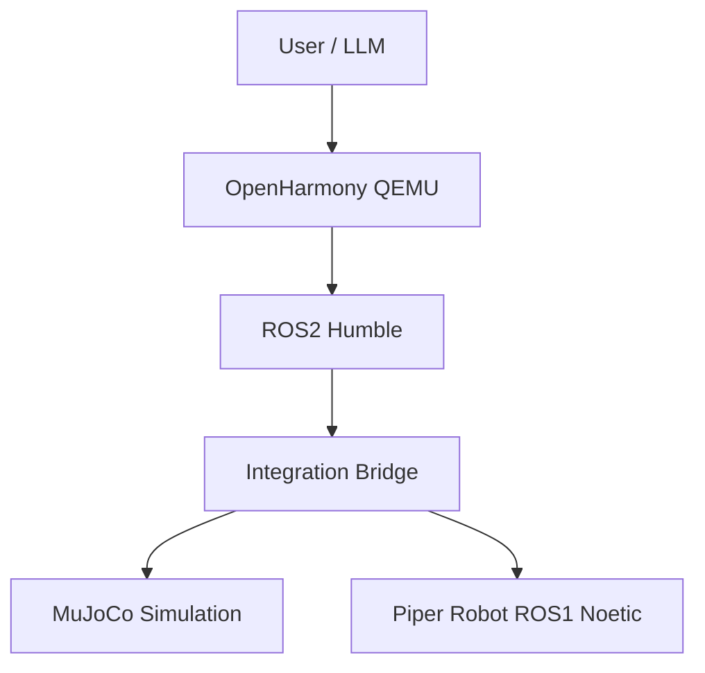
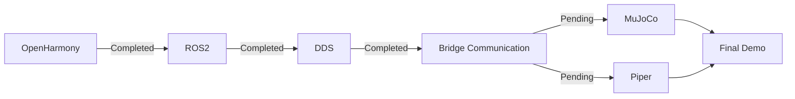

# System Architecture

> Last Updated: 2026-07-10

---

# Overview

This document describes the overall architecture of the Capstone Design project.

The goal is to demonstrate that **OpenHarmony actively participates in robot control**, while supporting both simulation and real hardware.

---

# Overall Architecture



---

# Communication Flow

```text
User
    │
    ▼
Natural Language

    │
    ▼
LLM

    │
    ▼
Robot Command

    │
    ▼
OpenHarmony

    │
    ▼
ROS2 Service

    │
    ▼
Integration Bridge

    ├────────────► MuJoCo

    └────────────► Piper
```

---

# Module Responsibilities

| Module | Description | Status |
|----------|-------------|--------|
| OpenHarmony | Robot operating system | ✅ |
| ROS2 | Communication middleware | ✅ |
| Integration Bridge | ROS2 ↔ Robot interface | 🚧 |
| MuJoCo | Simulation environment | 🚧 |
| Piper | Physical robot | 🚧 |
| LLM | Natural language understanding | 📋 Planned |

---

# OpenHarmony

Responsibilities:

- Run ROS2 node
- Send robot commands
- Communicate with host through DDS

Current status:

- ✅ QEMU working
- ✅ ROS2 running
- ✅ DDS connected
- ✅ Service call verified

---

# Integration Bridge

Responsibilities:

- Receive ROS2 commands
- Parse robot commands
- Forward commands to:
  - MuJoCo
  - Piper

Future extensions:

- LLM interface
- Unified robot command schema

---

# MuJoCo

Responsibilities:

- Pick and Place simulation
- Motion verification
- Robot state feedback

Current status:

- Under development by simulation teammate.

---

# Piper

Responsibilities:

- Execute robot motions
- Receive control commands

Current status:

- ROS Noetic
- Robot movement verified

Pending information:

- Interface type
- Message type
- Control API

---

# LLM

Recommended deployment:

```text
OpenHarmony

↓

ROS2

↓

Host LLM

↓

Robot Command

↓

Bridge

↓

MuJoCo / Piper
```

The LLM should **run on the host**, not inside OpenHarmony QEMU.

---

# Current Progress



---

# Future Work

## Phase 1

- [x] OpenHarmony
- [x] Docker
- [x] ROS2
- [x] DDS

## Phase 2

- [ ] Bridge
- [ ] MuJoCo
- [ ] Piper

## Phase 3

- [ ] LLM
- [ ] Unified Command Interface
- [ ] Final Demonstration

---

# Notes

This repository is an **integration repository**.

It does **not** replace:

- oh_robot_sim
- OpenHarmony source code
- ROS packages

Instead, it provides:

- Integration documentation
- Configuration
- Startup scripts
- Bridge implementation
- Team collaboration

